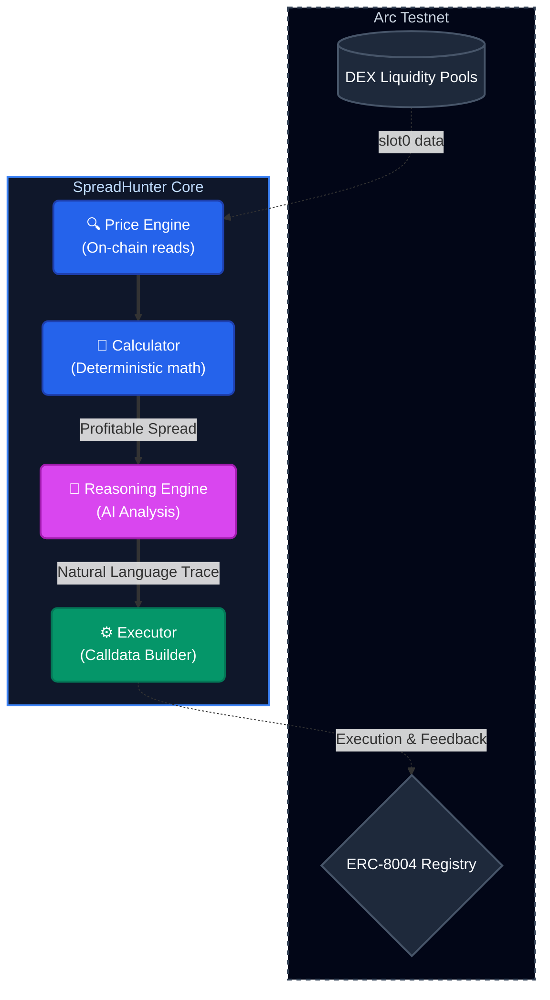
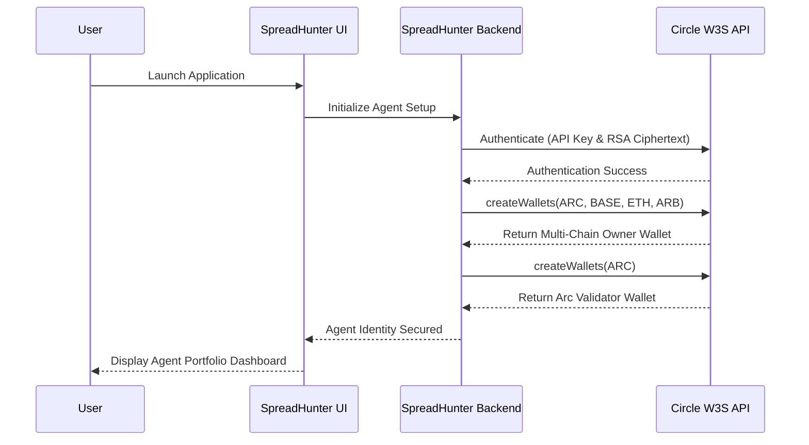
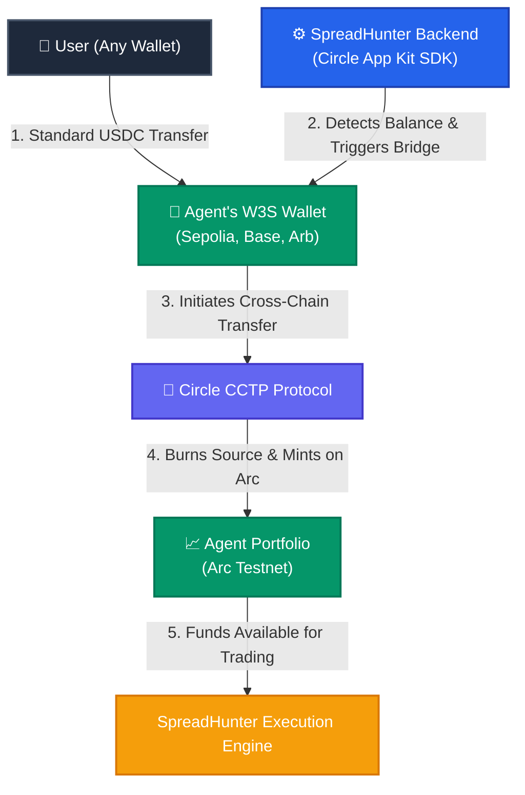

# SpreadHunter

<div align="center">

**An autonomous AI arbitrage agent operating on Arc Testnet, scanning cross-DEX price spreads for EURC/USDC and executing profitable trades with on-chain reputation tracking.**

[](https://nodejs.org)
[](https://react.dev)
[](https://vitejs.dev)
[](https://ethers.org)
[](https://circle.com)
[](https://circle.com)
[](https://arc.network)
[](https://docs.arc.network)
[](LICENSE)

</div>

---

## Overview

SpreadHunter is a **hybrid deterministic + AI arbitrage agent** that continuously monitors price spreads across decentralized exchanges on Arc Testnet. When a profitable opportunity is detected, it generates a natural-language reasoning trace via an advanced LLM, executes the trade, and records its reputation on-chain via the **ERC-8004 Agent Registry**.



---

## Architecture & Workflows

SpreadHunter is designed for maximum abstraction, allowing users to deploy an AI agent without dealing with private keys or complex bridging protocols. We utilize **Circle Web3 Services (W3S)** and **Arc Agent Standards** to achieve this.

### 1. Zero-Friction Wallet Generation (Circle W3S)

To operate autonomously, the agent requires its own keys. Instead of forcing users to manage private keys, SpreadHunter leverages **Circle Developer-Controlled Wallets (WaaS)**. 

During the initial setup, the backend generates a secure Wallet Set that automatically creates:
- **The Owner Wallet:** A multi-chain wallet (Arc Testnet, Base Sepolia, ETH Sepolia, Arbitrum Sepolia) sharing the *exact same address*. This acts as the Agent's main portfolio.
- **The Validator Wallet:** A single-chain wallet on Arc Testnet responsible solely for signing and verifying the Agent's reputation feedback.



### 2. Auto-Bridging Deposits (Circle App Kit + CCTP)

Funding an agent on a specific L2/AppChain can be a high-friction process for users. SpreadHunter abstracts this away entirely using the **Circle App Kit** and **CCTP**.

Users simply transfer USDC to the Agent's address on their preferred network (e.g., Ethereum Sepolia). Our backend detects these funds and utilizes the Circle App Kit SDK to automatically bridge the USDC directly into the Agent's active portfolio on Arc Testnet. 



### 3. Execution & On-Chain Reputation (ERC-8004)

1. **Price Scanning:** Reads `slot0` from V3 liquidity pools deterministically (no oracle).
2. **Spread Calculation:** Computes raw spread, deducts estimated fees, and flags profitable arbitrage opportunities.
3. **AI Reasoning:** The Reasoning Engine calls an **advanced LLM** to generate a trader-like analysis of the opportunity.
4. **Execution:** The Executor builds calldata and submits the transaction.
5. **Reputation Anchoring:** After the trade, the `AgentRegistry` submits a `giveFeedback` call to the **Arc Testnet ERC-8004 Identity Registry**, anchoring the keccak256 hash of the LLM reasoning on-chain to build verifiable trust.

---

## Directory Structure

```
SpreadHunter/
├── backend/
│   ├── src/
│   │   ├── config.js           # Environment & static configuration
│   │   ├── walletManager.js    # W3S WaaS generation & Circle CCTP Auto-Bridging
│   │   ├── priceEngine.js      # On-chain reads via ethers.js
│   │   ├── calculator.js       # Deterministic spread math
│   │   ├── reasoningEngine.js  # AI analysis integration
│   │   ├── executor.js         # DEX Swap execution
│   │   ├── agentRegistry.js    # ERC-8004 identity & reputation
│   │   └── index.js            # Express API + WebSocket Broadcaster
│   ├── config.json             # Persistent agent state & network configs
│   └── package.json            
├── frontend/
│   └── src/
│       ├── App.jsx             # React dashboard & WebSocket client
│       └── components/         # UI Elements (Stats, Modal, Setup Wizard)
└── README.md
```

## Adding a New DEX

SpreadHunter is fully modular. To add a new DEX, add an entry to `backend/config.json`:

```json
{
  "name": "NewDex",
  "enabled": true,
  "type": "UniswapV3",
  "contracts": {
    "factory": "0x...",
    "router":  "0x..."
  },
  "routerType": "SwapRouter02"
}
```

No code changes are required. The DEX is automatically picked up on the next restart.

---

## Setup & Installation

### Prerequisites
- Node.js 22+
- npm or pnpm

### Installation

```bash
# Install backend dependencies
cd backend && npm install

# Install frontend dependencies
cd ../frontend && npm install
```

### Configuration

Copy the example environment file and add your keys:
```bash
cp backend/.env.example backend/.env
```

| Variable | Description |
|---|---|
| `ARC_RPC_URL` | Arc Testnet RPC endpoint |
| `LLM_API_KEY` | API key for the LLM provider (Anthropic) |
| `CIRCLE_API_KEY` | Circle Developer API Key for WaaS |
| `CIRCLE_ENTITY_SECRET` | 32-byte hex Entity Secret for W3S authentication |

### Running the Application

```bash
# Terminal 1 — Backend
cd backend && npm run dev

# Terminal 2 — Frontend
cd frontend && npm run dev
```

Open [http://localhost:5173](http://localhost:5173) in your browser. The Setup Wizard will guide you through creating your W3S Developer-Controlled Wallets and registering your Agent's ERC-8004 identity on Arc Testnet automatically.

---

## Tech Stack

| Layer | Technology |
|---|---|
| Agent Wallets | **Circle Web3 Services (Developer-Controlled Wallets)** |
| Auto-Bridging | **Circle App Kit** + **CCTP Protocol** |
| Agent Identity | **ERC-8004** (Arc Identity + Reputation Registry) |
| Blockchain interactions | **ethers.js v6** (RPC reads/writes) |
| AI Reasoning | Advanced LLM (Anthropic) |
| Backend | Node.js + Express + WebSocket |
| Frontend | React 19 + Vite 8 |
| Network | Arc Testnet (ChainID: 5042002) |
